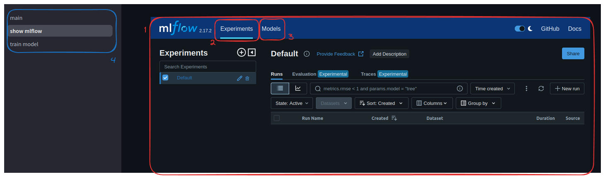

# **Wielowarstwowy perceptron do nierozpoznawania pisma ręcznego**
----------------------------------------------------------------

## Pojęcia 

MLP - Wielowarstwowy perceptron(multi layer perceptron)

streamlit - framework w python służący do tworzenia aplikacji webowych, dostosowany pod prezentacje danych i porosty interface

MLflow - Biblioteka/aplikacja zapewniająca kompleksowy system zarządzanie cyklem życia aplikacji data science i modeli  

numpy - wysoko wydajna, zaimplementowana w C biblioteka służąca do  obliczeń numerycznych macierzowych

hipeopt - bibliotek do optymalizacji hiperparametrów

sztuczna sieć neuronowa - zbudowane z wielu neurony połączona struktur jedno z jej odmian jest MLP

## Opis

Projekt zrealizowany  w języku python. Projekt zawiera implementacje algorytmu MLP, prostą aplikację web'owa w streamlit. i server mlflow do zarządzania modelami. 

Aplikacja webowa zapewnia możliwość  testowego użycia wybranego modelu, wyświetlanie servera mlflow i wytrenowania własnego modelu dobierając hipermarkety.

Server mlflow jest uruchamiany razem z aplikacją pozawala na zapisywanie eksprezydentów rejestrowanie modeli i ich wczytywanie.

MLP jest zdefiniowany  jako klasa w python następnie jest obiekt tej kasy jest inicjowany wewnątrz klasy mlflow  (mlflow.pyfunc.PythonModel) pozwalając ręcznie zaimplemętowany  model MLP jako “flavor” Mlflow.

## MLP Algorytm

Wielowarstwowy perceptron (MLP) jest podstawową formą sztucznej sieci neuronowej składającą się z przynajmniej trzech warstw neuronów: warstwy wejściowej, co najmniej jednej warstwy ukrytej i warstwy wyjściowej. Każda z tych warstw pełni specyficzną funkcję:

*   **Warstwa wejściowa** odbiera sygnały (dane) z zewnątrz i przekazuje je do kolejnych warstw.
*   **Warstwy ukryte** są miejscem, gdzie przetwarzane są bardziej złożone wzorce, a ich liczba i rozmiar wpływają na zdolność modelu do rozpoznawania skomplikowanych relacji w danych. MLP może posiadać jedną lub więcej takich warstw – więcej warstw oznacza większą głębokość sieci, a co za tym idzie, potencjalnie wyższą dokładność przy rozpoznawaniu wzorców.
*   **Warstwa wyjściowa** generuje wyniki końcowe, które w przypadku klasyfikacji reprezentują przewidywane klasy wejściowego obrazu (lub innego typu danych).

MLP jest trenowany za pomocą algorytmu propagacji wstecznej (backpropagation), który oblicza błędy i aktualizuje wagi połączeń między neuronami, minimalizując błąd predykcji modelu. Aktualizacje wag w każdym kroku bazują na regule gradientu wstecznego, co pozwala sieci uczyć się i dostosowywać do skomplikowanych danych wejściowych.

W procesie treningu MLP stosowane są funkcje aktywacji, takie jak ReLU (Rectified Linear Unit) dla warstw ukrytych, które pozwalają na modelowanie nieliniowych zależności, oraz softmax dla warstwy wyjściowej, która przekształca wynik na rozkład prawdopodobieństw. W celu przeciwdziałania przeuczeniu modelu (overfitting) stosowane są metody regularyzacji, jak regularyzacja L2, oraz dropout, który losowo „wyłącza” część neuronów podczas treningu.

## MLP Implementacja

 Algorytm wielowarstwowego perceptron  (src/app/ds/mlp.py) został zaimplementowany za pomocą języka python z użyciem biblioteki numpy.  

Klasa `MLP` implementuje wielowarstwowy perceptron (ang. _Multi-Layer Perceptron_, MLP) – rodzaj sieci neuronowej składającej się z warstwy wejściowej, jednej ukrytej warstwy oraz warstwy wyjściowej. Klasa jest zbudowana w języku Python przy użyciu biblioteki NumPy, która umożliwia efektywne operacje matematyczne.

### Konstruktor `__init__`

Metoda `__init__` inicjalizuje perceptron wielowarstwowy z następującymi hiperparametrami:

*   `input_size`: liczba neuronów w warstwie wejściowej (rozmiar wejścia),
*   `hidden_size`: liczba neuronów w warstwie ukrytej,
*   `output_size`: liczba neuronów w warstwie wyjściowej (liczba klas w zadaniu klasyfikacji),
*   `dropout_rate`: wskaźnik _dropout_, czyli prawdopodobieństwo „wyłączenia” neuronu podczas treningu (domyślnie 0.5),
*   `reg_lambda`: parametr regularyzacji L2, zapobiegający przeuczeniu modelu (domyślnie 0.01),
*   `learning_rate`: tempo uczenia modelu, kontrolujące wielkość kroków w kierunku minimum funkcji kosztu (domyślnie 0.1).

### Inicjalizacja wag:

*   Wagi warstw `W1` i `W2` są inicjowane za pomocą _He initialization_ dla poprawy stabilności modelu.
*   Biasy `b1` i `b2` są inicjowane jako wektory zerowe.

Inicjalizacja momentu:

*   Zmienna `momentum` jest wykorzystywana do przyspieszenia zbieżności gradientu, z ustawieniem domyślnym `beta = 0.9`.

### Funkcje aktywacji

*   `relu`: Funkcja aktywacji ReLU (ang. _Rectified Linear Unit_), która zwraca maksymalną wartość z 0 i danego wejścia.
*   `softmax`: Funkcja aktywacji _softmax_ używana w warstwie wyjściowej do klasyfikacji wieloklasowej, zamieniająca wyniki na rozkład prawdopodobieństwa dla każdej klasy.

### Metoda `forward`

Metoda ta wykonuje operację propagacji w przód (ang. _forward propagation_), obliczając wyjścia dla każdej warstwy sieci:

1.  Warstwa wejściowa: `Z1 = X * W1 + b1,` następnie zastosowanie aktywacji ReLU.
2.  Dropout: W warstwie ukrytej stosowana jest metoda _dropout_, redukująca przeuczenie modelu poprzez wyłączanie losowych neuronów z prawdopodobieństwem `dropout_rate`.
3.  Warstwa wyjściowa: `Z2 = A1 * W2 + b2`, na której stosowana jest funkcja _softmax_, zwracająca prawdopodobieństwa klas dla danego wejścia.

### Metoda `compute_loss`

Metoda ta oblicza stratę (ang. _loss_) w postaci entropii krzyżowej z regularyzacją L2, co pozwala na karanie dużych wag modelu, zmniejszając ryzyko przeuczenia.

### Metoda `backward`

W tej metodzie przeprowadzana jest propagacja wsteczna (ang. _backward propagation_), która oblicza gradienty dla każdej wagi i biasu w modelu. Gradienty te są następnie używane do aktualizacji wag, z użyciem momentu w celu zwiększenia stabilności procesu uczenia:

1.  `dZ2`: Błąd w warstwie wyjściowej.
2.  `dW2`, `db2`: Gradienty dla wag i biasu w warstwie wyjściowej.
3.  `dZ1`: Błąd w warstwie ukrytej.
4.  `dW1`, `db1`: Gradienty dla wag i biasu w warstwie ukrytej.

### Metoda `train`

Metoda ta realizuje trening modelu przy użyciu mini-batch gradient descent. Parametry:

*   `X_train`, `Y_train`: Dane treningowe.
*   `X_val`, `Y_val`: Dane walidacyjne.
*   `epochs`: Liczba epok, czyli pełnych iteracji na zbiorze treningowym.
*   `batch_size`: Rozmiar mini-batch (domyślnie 64).
*   `initial_lr`, `decay`: Początkowe tempo uczenia oraz tempo jego spadku.
*   `patience`: Liczba epok, po których nastąpi zakończenie treningu w przypadku braku poprawy.

####  Podczas treningu stosowane jest:

1.  Stopniowe zmniejszanie tempa uczenia.
2.  Wczesne zatrzymanie (ang. _early stopping_), kończące trening, jeśli walidacyjna strata nie poprawia się przez wybraną liczbę epok.

#### Metody `predict_proba` i `predict`

*   `predict_proba`: Zwraca prawdopodobieństwa klas dla danych wejściowych.
*   `predict`: Zwraca klasy o najwyższym prawdopodobieństwie dla danych wejściowych.

## MLFlow

MLFlow służył podczas fazy eksperymentów do śledzenia metryk i parametrów modelu, doboru właściwej architektury i parametrów. Pozwała też w ujednolicony sposób przechowywać i wersjonować modele. 

W celu zapisania customowego modelu MLP użyto mlflow.pyfunc.PythonModel) który umorzeniowa zapisania dowolnego kodu pythonowego jako model mlflow. 

Mlflow przechowuje swoje dane  **/app/mlflow\_data/mlruns - jako docker** lub  **/mlruns - uruchamiane lokalne**, znajdują się tam informacje o eksperymentach jak i zapisane modele. 

Aplikacja automatycznie uruchamia server mlflow umoralniający interakcje z narzędziem w forme webowej.

Więcej w sekcji **obsługa**.

## Streamlit

Fremework wykorzystany od stworzenie prostego interface do obsługi i testowania modelu i trenowania modelu.

Aplikacja łączy się z mlflow co umorzeniowa wczytanie i użycie modelu, podgląd mlflow z poziomu aplikacji i wytrenowanie nowego modelu na własnych parametrach.

Więcej w sekcji **obsługa**.

## Uruchomienie
------------

### Wymagania

*   **Docker**
*   **System operacyjny z  GUI**
*   **(opcjonalnie ) Git**
*   **(opcjonalnie ) Python**

Pierwszym kroku musisz sklonować rapo na swoje urządzenie, lub pobrać kod

### Docker

#### Budowa obrazu

`docker build -t mlp-app .`

#### Uruchomienie kontenera

`docker run -p 8501:8501 -p 5000:5000 mlp-app`

Uruchomieni aplikacja w tej form spowoduje zachowanie stanu i nowych modeli wewnątrz kontenera  ale przy tworzeniu nowego stan nie będze zachowany.

Jeśli aplikacji ma zachować dane niezależna od kontenera należy ją uruchomić z odpowiedni volume np. :

`docker run -p 8501:8501 -p 5000:5000 -v $HOME/mlp/mlflow_data:/app/mlflow_data mlp-app`

#### Wejście do aplikacji 

Po uruchomieniu kontenera aplikacja powinna być dostępna na `127.0.0.1:8501` a mlflow `127.0.0.1:5000`

### Python

Uruchomienie bez użycia dokera wymaga zainstalowanego pythona i w zależności od systemu operacyjnego może wymagać zainstalowania kilku narzędzi

Zalecane  jest utworzenie wirtualnego środowiska z użyciem (instrukcja w przypadku używanie pipa (możliwe jest np użycie uv) 

`python3 -m venv .venv` 

Aktywacja dla linux :

`source .venv/bin/activate`

Instalacja bibliotek:

`pip install -requirements.txt`

Uruchomienie aplikacji:

`python -m streamlit run src/app/main.py`

Uruchomienie server mlflow (nie jest wymagane do działania aplikacji)

`python -m mlflow server`

Uruchomienie samego treningu

`python src/app/ds/mlp.py`

Uruchomienie hyperopta

`python src/app/ds/hyper_params_tune.py`

## Obsługa
-------

### Aplikacja

Aplikacja dzieli się na 3 podstrony

*   **main**
*   **show mlflow**
*   **train model**

### main

Główna strona aplikacja służy testowania modelu, umożliwia wybranie jednego z zarejestrowanych modeli i jego test.

⚠️ **MODEL NIE JEST DOSTOSOWANY OD ODCZYTYWANIE PISMA NARYSOWANEGO KOMPUTEROWO, TYLKO RĘCZNEGO ZESKANOWANEGO, MIMO NP 95% “ACCURACY” MODEL PODCASTS TESTÓW W APLIKACJI RADZIĆ SOBIE ZDECYDOWANE GORZEJ.**

1.  Wybór strony aplikacji.
2.  Wybór modelu z zarejestrowanych modeli w mlflow.
3.  Okienko rysowania, należy  narysować cyfrę która zostanie rozpoznana.
4.  Wykres rozkładu prawdopodobieństwa dennej cyfry według modelu.
5.  Opcje okienka rysowania, umoralniające aktualizacje aplikacj bez konieczności zatwierdzenie obrazka i schowanie opcje ryswania pod obrazkiem.
6.  Inne strony aplikacji.  
     

### show mlflow

Strona pokazuje uruchomiony server mlflow, umożliwia interakcje i podgląd modeli, jaś chcemy otworzyć w pełnym oknie wystarczy kliknąć prawym i otworzyć w nowej karcie.

1.  Okno z otwartą stroną mlflow
2.  Zakładka eksperymentów
3.  Zakładka modeli
4.  Pozostałe strony

### train model

Strona pozwalając wytrenować model MLP w zdefiniowanej architekturze ale z własnymi hiper parametrami

1.  Wprowadzanie własnych hiper parametrów, dokładny opis hiperparametrów w _MLP Implementacja_
2.  Uruchomienie Trenowania modelu na wybranych hiperparametrach
3.  stdout z konsoli aplikacji pozwalający śledzić postęp modelu.
4.  Pozostałe zakładki.

## Program

Sam kod źródła ma więcej możliwości np znajdowanie optymalnych hiperparametrów za pomocą hiperopt, czy zmiany kodu źródłowo mlp by przetestować inną architecture sztucznej sieci neuronowej.

Możliwe jest też modyfikowanie aplikacji, zmiany danych treningowych czy dodawanie nowych feature.

Te podejście wymaga uruchomiania kodu źródłowego, niezainstalowane wymaganych bibliorek więcej w sekcji _Python._